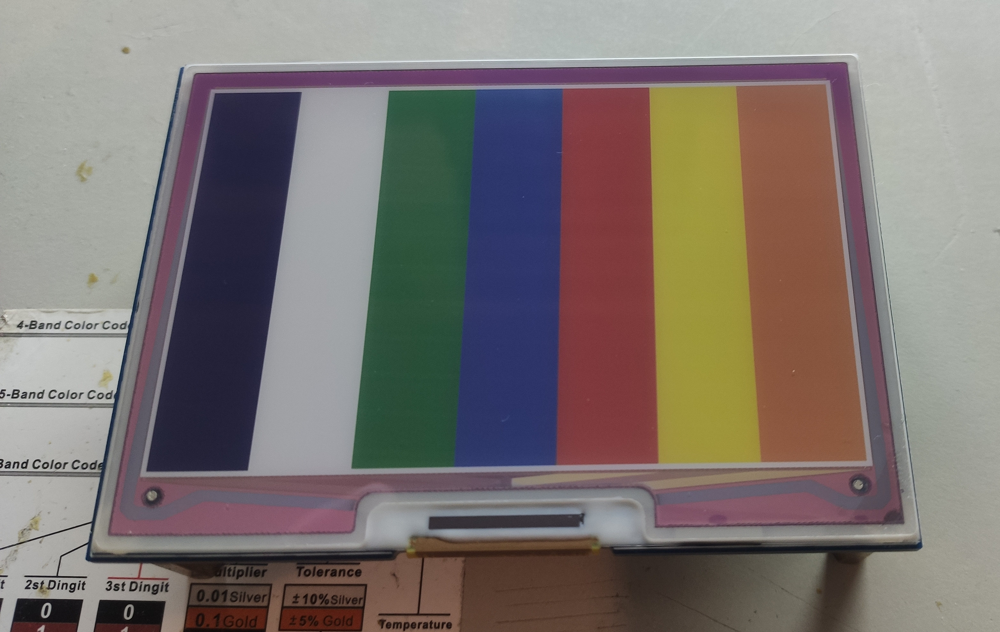

# GD32VF E-Paper Project
This is a basic project and library for the [4.01" 7-color e-paper-display by waveshare](https://www.waveshare.com/4.01inch-e-paper-hat-f.htm). The library is considered "complete" for basic usage.

To draw images on the display, the PIF library is used in this case. Together with a special color table that fits the display's color capabilities, and the library's feature to bypass the color table, an image can be directly converted to the right format to this display and directly drawn onto it.

Here is an image rendering a basic color pattern on the display:

In this image, a .PIF file (embedded as Header file) has been loaded onto the display:

