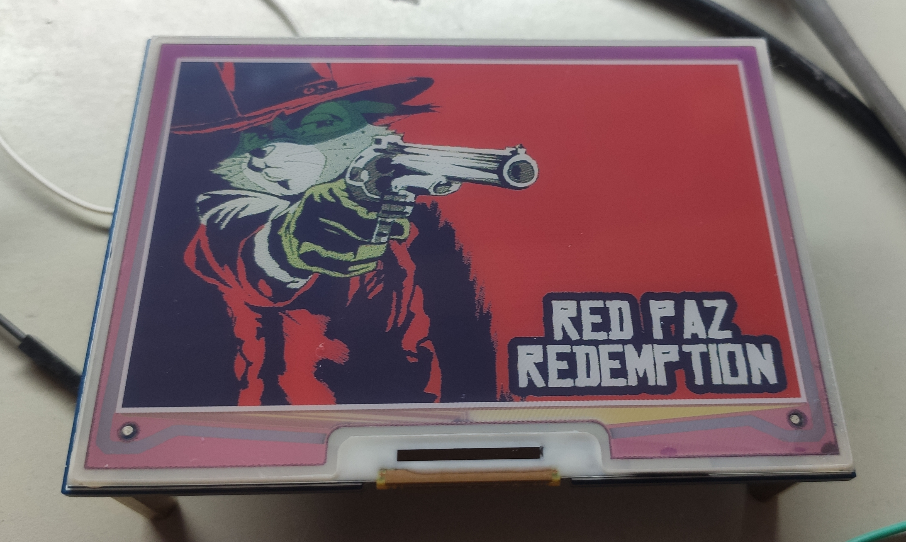
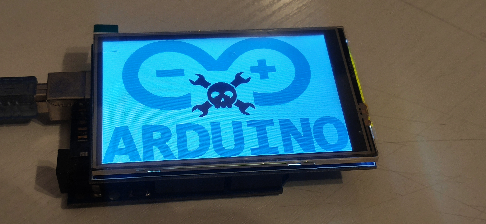

# PIF C Examples
This folder contains references and examples for various usages with the PIF C Library, to display on either very casual display or special display methods, as well as demonstrate various methods to load the PIF data from either a storage system or from the flash memory.

This page contains a overview of the various demo projects, a basic description and a image. The examples are contained within a PlatformIO or AtmelStudio project, ready to deploy and run.

## ATXMEGA384C3 (AVR) / 24-Bit Graphic Display / External flash memory
Main Enviroment when developing the PIF C Library, using a FAT16-formatted 64MB Flash Memory Chip to store and load the images from. Uses a 1024 x 600 Pixel Display using the RA8876 Controller, proving itself handy to test the library thanks to it's native support of 8bpp, 16bpp and 24bpp pixel data.

## [GD32VF103 (RISC-V) / 7-Color E-Ink Display / Internal flash memory](GD32VF_epaper/README.md)
Loading an pif image, as a header file, from the flash memory and displaying it on a 7-color e-ink display. Thanks to a special flag in the library, instead of looking up the color of the 7-color-index table, the index value itself is sent directly to the drawing routines, allowing direct image conversion to e-paper display and displayign it easily on such - should likely work on many other displays that have similar quirks (for example 4-grayscale displays, red/black/white e-papers etc.)

## Arduino Uno (AVR) / 16-Bit Graphic Display / Internal flash memory
Basic demo using the classic Arduino Uno and a simple 320 x 480 Pixel Display, supporting 16bpp data. This should give arduino users a basic idea how the image viewer can be used in an Arduino enviroment.
Please note, due to the lack of avr-g++'s support for __flash and __xmem, PIF header files need to be adjusted manually to "PROGMEM" ( see the arduino project for more details )

