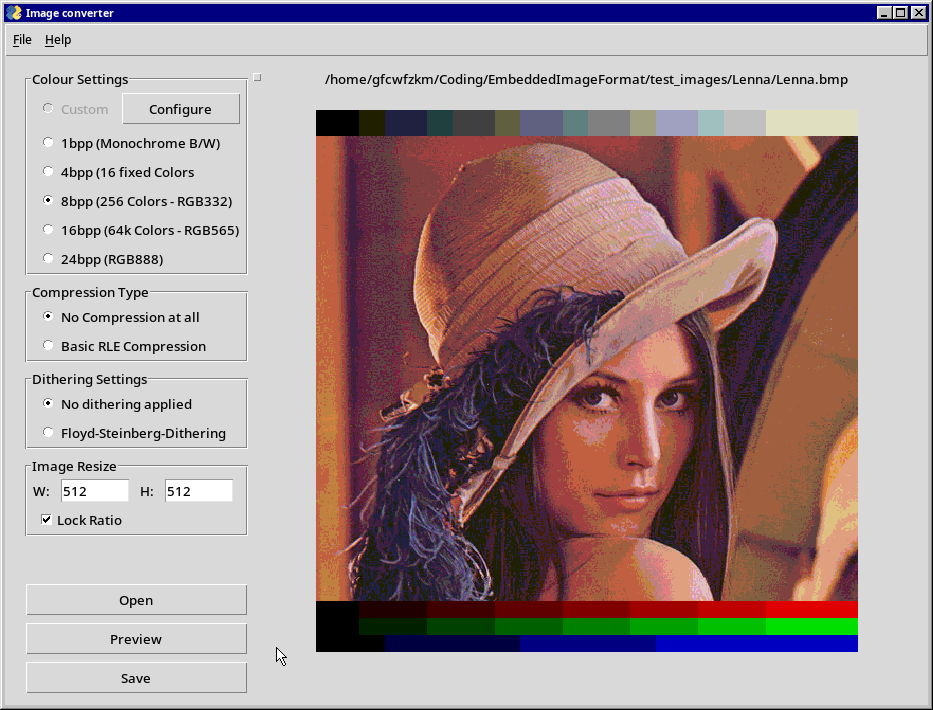
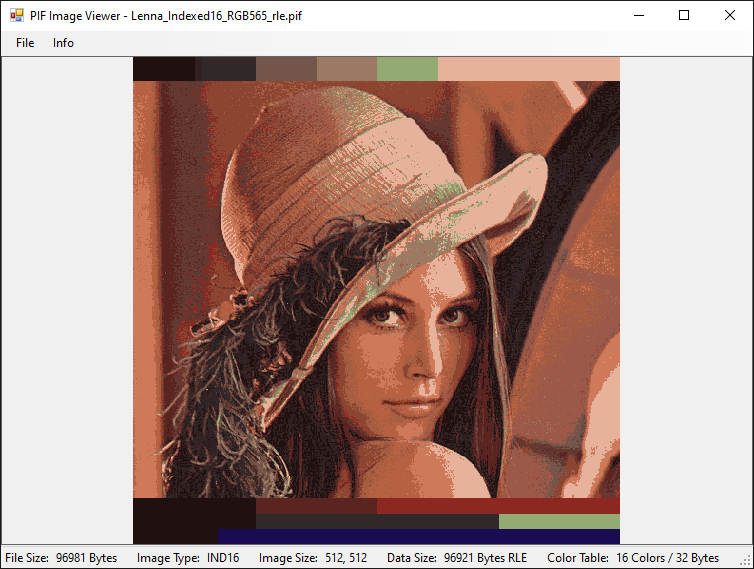

# PIF - «Portable Image File» Format
## Overview
The Portable Image Format (PIF) is a basic, bitmap-like image format with the focus on ease of use (implementation) and small size for embedded applications. The file format not only offers special, reduced color sets to reduce size where 24-bit resolution are not required (or unable to be rendered by the display), but also features variable sized color tables to achive good-looking, custom images at reduced bit-per-pixel size. To further reduce the size of the image data, a simple RLE-compression can be used without loosing too many cycles on decompression. Thanks to supporting various Bit-Per-Pixel formats, RGB565 and RGB332 can be directly written to LCD displays who support it, and don't need additional image data conversion.

## Features
 - **Runs on any Microcontroller (or better) with at least 60 bytes of free RAM** (checked on ATmega328p)
 - Easy implementation via callback functions, allowing flash-memory or files as source
 - Export as a .pif or .h C-Header file
 - No external depencies or use of malloc/free
 - Fast execution and low memory profile
 - Various Bitformats supported:
   - RGB888 - Uncompressed RGB Image
   - RGB565 - 16bit per Pixel Image, reduced colorset
   - RGB332	- 8bit per Pixel Image, further reducing colors and size
   - RGB16C	- 4bit per Pixel Image, fixed Windows/IBM Style 16 colors
   - B/W - 1bit per Pixel Image, only Black and White
   - Indexed - Custom Pixel bitwidth, using a RGB332, RGB565 or RGB888 color table
 - Basic Compression (RLE)
 - Allows to draw on any kind of display, including exotic ones like grayscale or e-ink displays

## Why another Image Format?
I know, I know, there are way too many image standards and I'm sure there is a xkcd comic panel about it already. On the one side this project is an excuse for me to take a deeper look into python and figure this programming language out, on the otherside I have gotten frustrated with the options when one wants to load images on a display from a microcontroller. I've encountered always the same problems there:

Either the compression used on the image format (png/jpg) makes it slow to display the image, but it's at least fast to read due to the small size.
Or the format looked like it was from the late 80s with various extensions bodged into it, resulting into large sizes and oddities to handle (image building from the bottom upwards, for example).

With PIF I am trying to address both issues at once: A image format that is easy to implement and process on weak hardware, while offering smaller sizes. This is achived by a very basic image and file header that is easy to read, a simple RLE compression to reduce size as well as more color options for the pixel when less colors are required. (Plus it gives me a fun project and something to invest my freetime into.)

## Comparison
If the File Format is compared against bitmap, one can see that the image size reduces heavily specially at lower color densities, which are not unlikely to encounter with many displays used at embedded systems. Specially with RLE compression enabled, the image format performs better on images without noise or too many changing colors. The following comparison table was done using the popular "Lenna" image, which can be seen as a worst-case scenario with it's noise.

| Image Type    | File Size (Bytes) | BPP | Compression |
|---------------|-------------------|-----|-------------|
| Bitmap (.BPP) | 786 486           | 24  | None        |
| PIF RGB888    | 786 460           | 24  | None        |
| PIF RGB888    | 739 358           | 24  | RLE         |
| PIF RGB565    | 524 316           | 16  | None        |
| PIF RGB565    | 434 320           | 16  | RLE         |
| PIF RGB332    | 262 172           | 8   | None        |
| PIF RGB332    | 160 893           | 8   | RLE         |
| PIF RGB16C    | 131 100           | 4   | None        |
| PIF RGB16C    | 67 280            | 4   | RLE         |
| PIF B/W       | 32 796            | 1   | None        |
| PIF B/W       | 13 295            | 1   | RLE        |

All image files can be found in test_images\Lenna, together with some dithered and indexed examples.
## Tools
### PIF Image Converter
( Required pip packages: [Pillow](https://pillow.readthedocs.io/en/stable/), [PySimpleGUI](https://pysimplegui.readthedocs.io/en/latest/) )

A basic tool that allows to save various image formats (.jpg/.bmp/.png) to the .PIF Image Format. Within the program, various color settings can be applied with dithering, resizing the image as well as include the RLE compresison or not.
### PIF Image Viewer
( Required: .NET Framework or Mono )

A small image viewer for the PIF image format. It supports all color modes and shows various informations about the image. PIF Images can be exported back to Bitmap (.bmp) files.
## C Library & Examples
The library presented here is made to support the whole image format specifications as well as support any kind of display and storage medium. For indexed images, a indexed-colors-buffer is not required but recommended to speed up the operation. Otherwise the library will seek back and forth between the image data and the color table. Even a partial buffer is supported, to speed up the uses of commonly used colors from the table.

To use the library, the file I/O functions as well has drawing functions have to be passed to the library. Using he file I/O functions, pretty much any kind of storage system can be used, including the internal flash memory if a basic read function is coded for it.

```c
#include "pifdec.h"

...

pifPAINT_t pifPaintingStruct;
pifIO_t pifFileIOStruct;
pifHANDLE_t pifHandler;

/* Optional Buffer to speed up the operation of indexed images */
uint8_t optionalColorTable[32];

/* Preparing the painting structure */
pif_createPainter(&pifPaintingStruct,	// Structure to initialise
                display_PrepareOp,	// Optional func called before drawing
                display_DrawPixel,	// Painting the image, pixel by pixel
                display_Refresh,	// Optional func when done drawing
                NULL,				// Optional display handler pointer
                optionalColorTable,	// Optional color table
                sizeof(optionalColorTable)	// Size of the color table
);
/* Preparing the I/O function */
pif_createIO(&pifFileIOStruct,	// Structure to initialise
            fs_open,			// Opening the file or preparing the operation
            fs_close,			// Closing the file / finishing the operation
            fs_read,			// Reading the file
            fs_seek				// Changing file index position
);
/* Last but not least, combining the previous handlers */
pif_createPIFHandle(&pifHandler, &pifFileIOStruct, &pifPaintingStruct);

...

/* Now an image can be drawn simply by calling "pif_OpenAndDisplay" */
pifRESULT res = pif_OpenAndDisplay(&pifHandler,	// Pass over the PIF Handler
                "0:TESTIMAGE.PIF",	// string directly passed to fs_open
                0,					// X positon on the display
                0					// Y position on the display
);

/* Check if any of the Drawing or FileIO function returned a error: */
if (res != PIF_RESULT_OK)
{
    // Process error...
}

```

In order to support even certain grayscale or e-ink displays, the library can ignore the color lookup table and directly send the raw value to the display driver, allowing to use the indexed lookup table as a way to implement custom formats suited for the specific display.

[Check the examples to see possible implementations and capabilities](/C%20Library/examples/README.md)

## Todo
We still have some steps ahead of us before this project can be considered finished. Here a rough overview of the things that are already done or that are still missing.
 - [x] Image Converter
	- [x] Basic GUI implementation & preview
	- [x] Dithering Options
	- [x] Saving as .PIF
	- [x] Custom (Indexed) options
 - [x] Image viewer
	- [x] Display the image
	- [x] Show details and stats
	- [x] Allow Export to other image formats
 - [x] Portable C Library Code & Examples
	- [ ] Reference implementation for various platforms
		- [ ] Arduino / Arduino-Framework
		- [ ] ATxmega
		- [x] GD32VF103 (RISC-V)
	- [x] Universal / Portable C Library
